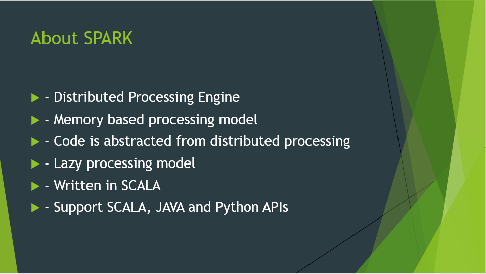
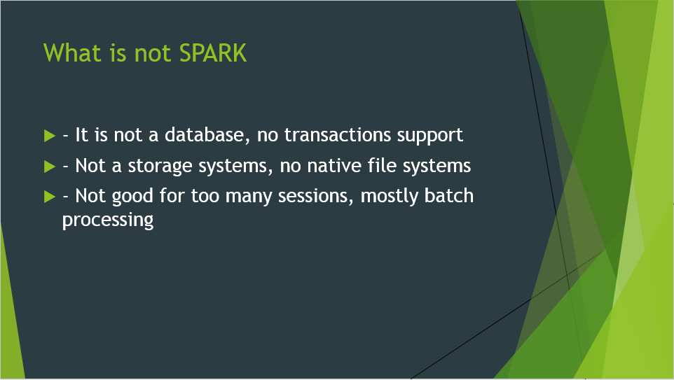
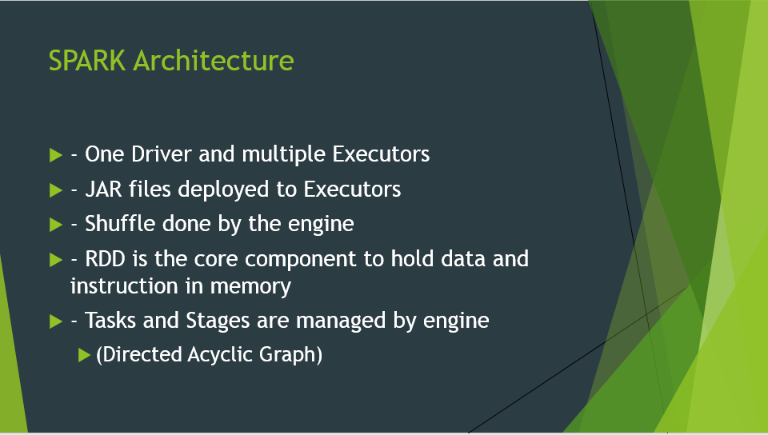
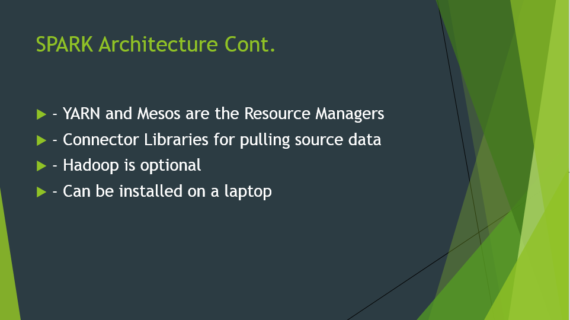
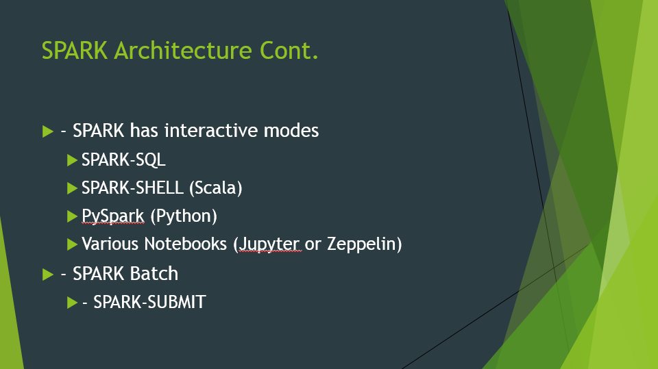
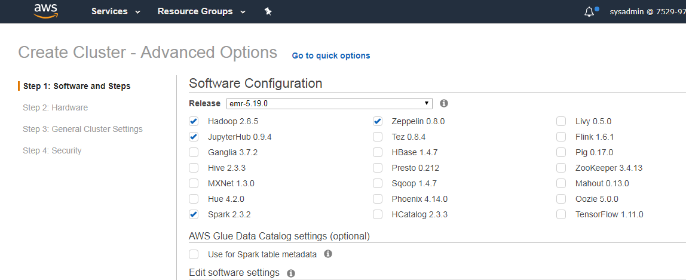

# Spark Batch Process POC
## Summary
This is a simple demonstration of Batch processing in Spark using Scala language and hadoop HDFS file system. 

### About Spark

### Spark Cluster
All cloud providers will offer automated installation and configuration options

## Transaction Files and Master Data Files
### Staging the files

### Converting into Parquet 
[csvtoparquet.scala](source_code/csvtoparquet.scala)
<code insert>
### Lessons Learned
	- Spark supports many different file formats
	- Spark supports four different API methods
		-- RDD APIs
		-- DF APIs
		-- Data Sets APIs
		-- Spark-SQL table definition
	- How to install SBT and use it
Sign into master node as hadoop user
From home directory run commends

sudo curl https://bintray.com/sbt/rpm/rpm | sudo tee /etc/yum.repos.d/bintray-sbt-rpm.repo
sudo yum install sbt
sudo su
mkdir sbt_workspace
cd sbt_workspace
mkdir perpinv
cd perpinv
sbt

## Create Spark SQL Metadata for transaction files
Lessons Learned
	- Metadata can be created and managed in local file system
		or it can be managed using Hive metastore
	- You can also implement temporary views within a spark context
	
## Create Transaction Header and Transaction Details files in CSV

## Create Spark SQL Metadata for transaction Header and Details files

## Bring Stg Stck PPO (End Results) file for merging

## Create Spark SQL Metadata for results files

## Run Final results file transformation

