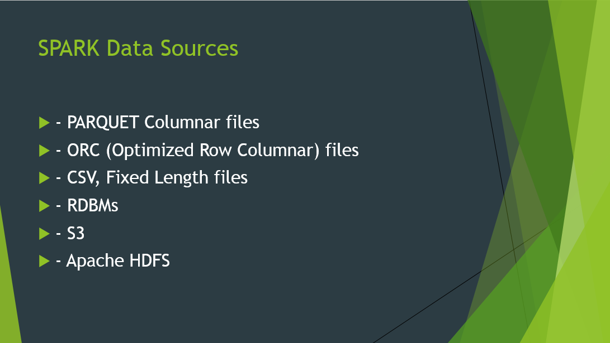
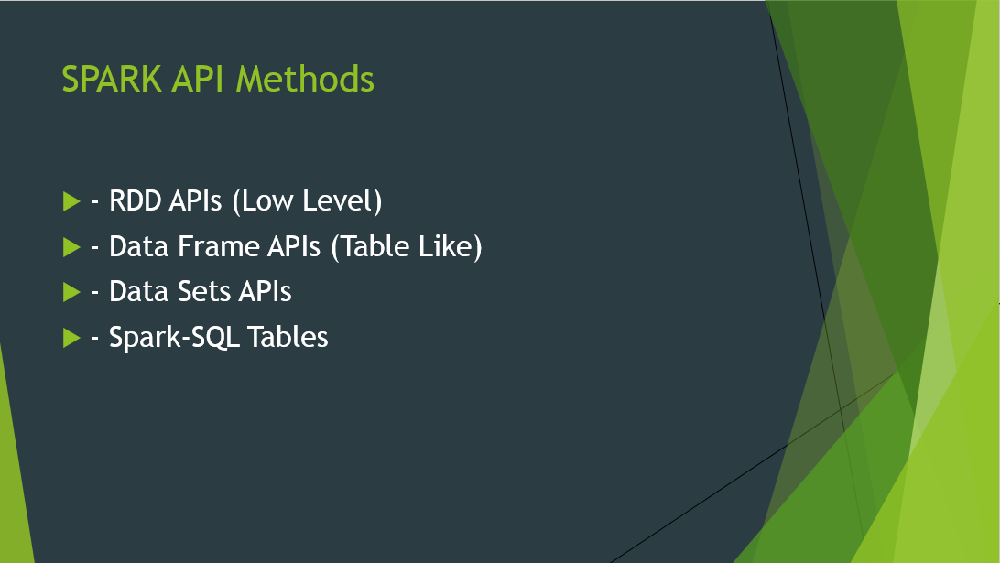
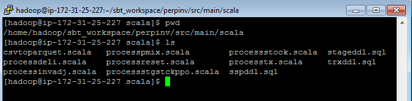
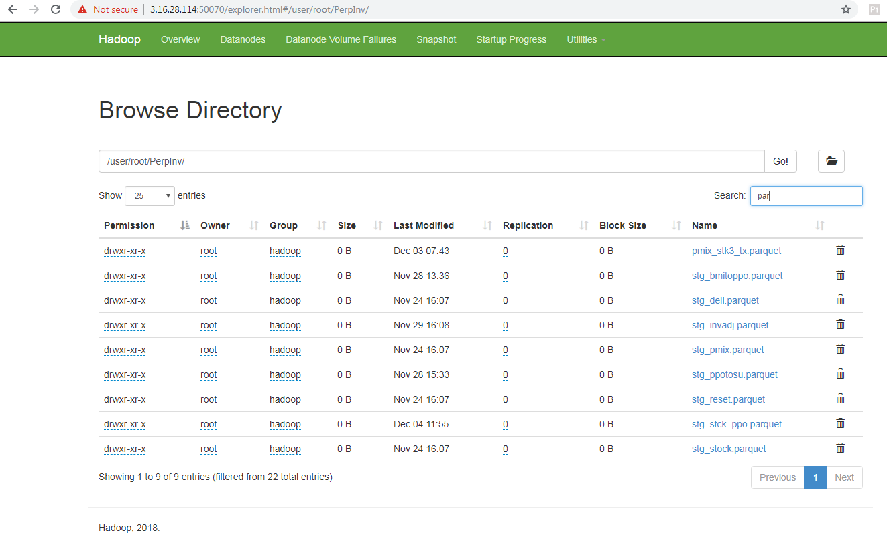
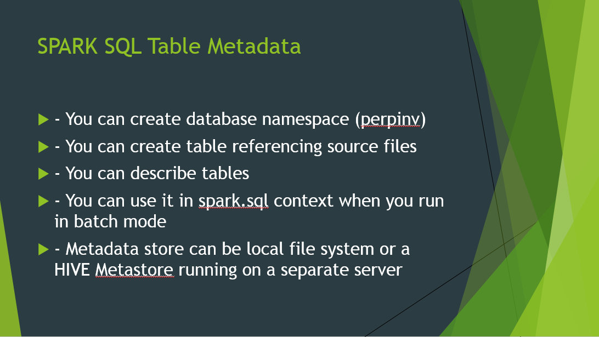

# Spark Batch Process POC
## Summary
This is a simple demonstration of Batch processing in Spark using Scala language and hadoop HDFS file system. 

### About Spark


### Spark Cluster
All cloud providers will offer automated installation and configuration options


## Transaction Files and Master Data Files
### Staging the files

### Converting into Parquet 
| CSV TO PARQUET | [csvtoparquet.scala](source_code/csvtoparquet.scala) |
| -------------- | ---------------------------------------------------- |




## How to install SBT and use it
```
Sign into master node as hadoop user
From home directory run commends

sudo curl https://bintray.com/sbt/rpm/rpm | sudo tee /etc/yum.repos.d/bintray-sbt-rpm.repo
sudo yum install sbt
```

```
Directory Structure : /user/hadoop/sbt_workspace/perpinv/src/main/scala
```

Configuration File at (/user/hadoop/sbt_workspace/perpinv/build.sbt)
```
name := "spark perpinv App"
version := "0.1"
organization := "com.poc"
scalaVersion := "2.11.8"
val sparkVersion = "2.3.2"

libraryDependencies ++= Seq(
"org.apache.spark" %% "spark-core" % sparkVersion,
"org.apache.spark" %% "spark-sql" % sparkVersion)
```

Create source in /user/hadoop/sbt_workspace/perpinv/src/main/scala as :


To package JAR files using SBT:
```
sbt package
```

To submit it to Spark
```
spark-submit --master yarn --class com.poc.examples.csvtoparquet target/scala-2.11/spark-perpinv-app_2.11-0.1.jar
```

Hadoop File System Screen Shot



## Create Spark SQL Metadata for transaction files

| STG DDL | [stageddl.sql](source_code/stageddl.sql) |
| -------------- | --------------------------------- |

Spark Table Metadata


## Create Transaction Header and Transaction Details files in CSV

| Process PMIX   | [processpmix.scala](source_code/processpmix.scala) |
| -------------- | -------------------------------------------------- |
| Process DELI   | [processdeli.scala](source_code/processdeli.scala) |
| Process INVADJ | [processinvadj.scala](source_code/processinvadj.scala) |
| Process STOCK | [processstock.scala](source_code/processstock.scala) |
| Process RESET | [processreset.scala](source_code/processreset.scala) |

## Create Spark SQL Metadata for transaction Header and Details files

## Bring Stg Stck PPO (End Results) file for merging

## Create Spark SQL Metadata for results files

## Run Final results file transformation

