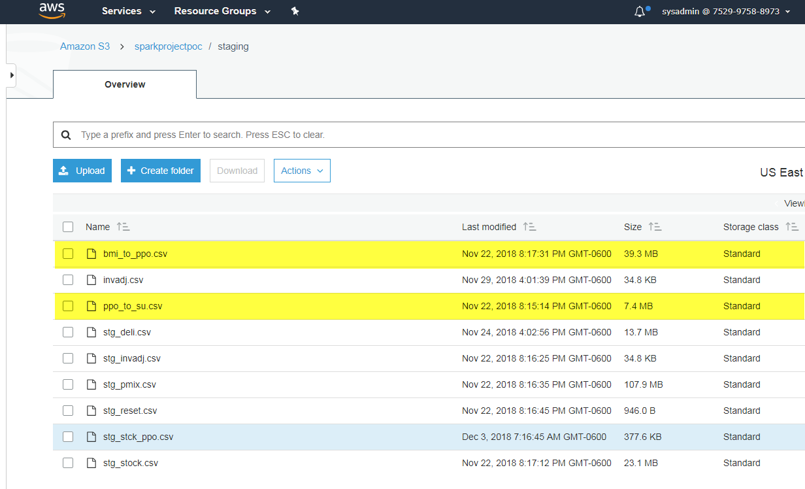

# Spark Batch Process POC
## Summary
This is a simple demonstration of Batch processing in Spark using Scala language and hadoop HDFS file system. 

### About Spark


### Spark Cluster
All cloud providers will offer automated installation and configuration options


## Transaction Files and Master Data Files
### Staging the files

### Converting into Parquet 
| CSV TO PARQUET | [csvtoparquet.scala](source_code/csvtoparquet.scala) |
| -------------- | ---------------------------------------------------- |


## How to install SBT and use it
```
Sign into master node as hadoop user
From home directory run commends

sudo curl https://bintray.com/sbt/rpm/rpm | sudo tee /etc/yum.repos.d/bintray-sbt-rpm.repo
sudo yum install sbt
```
Configuration File (build.sbt)
```
name := "spark perpinv App"
version := "0.1"
organization := "com.poc"
scalaVersion := "2.11.8"
val sparkVersion = "2.3.2"

libraryDependencies ++= Seq(
"org.apache.spark" %% "spark-core" % sparkVersion,
"org.apache.spark" %% "spark-sql" % sparkVersion)
```

## Create Spark SQL Metadata for transaction files
Lessons Learned
	- Metadata can be created and managed in local file system
		or it can be managed using Hive metastore
	- You can also implement temporary views within a spark context
	
## Create Transaction Header and Transaction Details files in CSV

## Create Spark SQL Metadata for transaction Header and Details files

## Bring Stg Stck PPO (End Results) file for merging

## Create Spark SQL Metadata for results files

## Run Final results file transformation

